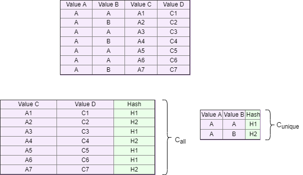

# Fractal Compression

The method of fractal compression of databases belongs to the
family of dictionary compression methods. The idea of dictionary compression methods is to
replace strings of characters with codes that can be interpreted as indexes of strings in some
dictionary. Indexes are constructed in such a way that, on average, their representation takes
up less memory than the replaced strings, which is why compression occurs. The compression
method is a development of the ideas of dictionary compression, but unlike other methods of this family, it works with several columns and encodes not a string,
but a set of strings.

A modification of this method is based on using the hash function value from the
concatenation of a set of strings as an index in the dictionary, which allows you to replace
unique values with hash function values and put unique values in a separate table in parallel.
The advantages of this approach include the high speed of the method. The disadvantages
of this approach include the need for careful selection of the hash function used, since there
may be a situation where the dictionary and compressed tables obtained during the method
will be larger  than the original table. Also, the disadvantages of this method include
the need for preliminary verification of the values obtained when using the hash function,
since in the event of collisions, some  values may be lost.

At the first stage of the method, the attributes are pre-filtered for further compression.
Since the number of possible sets of attributes increases significantly as the number of
attributes increases, it is necessary to limit the number of attributes in some way. At the
pre-filtering stage, the number of unique values in the attribute is estimated, the amount of
memory required to store the attribute data type is determined, and the potential compressibility
of the attribute is determined based on the ratio of unique values to the total number of
values.

At the second stage of the method, the optimal set of attributes is selected based on
one of the strategies. Since the problem of selecting an optimal set can be reduced to the
solution of the knapsack problem, both exact methods of solving it, such as brute force or
the method of branches and bounds, and dynamic programming methods, such as genetic
algorithms, can be used to solve it.
In the third stage of compression takes place directly in the source table. Compression
passes in several steps:
1. allocation of unique values to the dictionary with assignment of a unique identifier;
2. iterating through the original table:
   (a) search for an identifier in the dictionary;
   (b) entering the identifier in the source table.
3. deleting columns of unique values from the source table.

Example of the fractal compression method

Unlike the original method, the modified method has two new stages. On the first of them,
the hash function is determined, the size of the resulting value is determined, and if necessary,
the function or procedure that implements the hash function is loaded. At the second stage,
the hashes from the selected optimal set are evaluated. The optimal set contains information
about the number of unique values allocated at the second stage, which can be used to
evaluate the correctness of the method. The mismatch between the number of unique hashes
and the number of unique sets of values indicates the occurrence of collisions. Depending
on the implementation, when an error occurs at this step, either the program terminates, or
various methods can be applied to resolve collisions, such as adding a cryptographic salt to the input value of the hash function.

To solve the problem of choosing the best domain under time constraints, genetic
algorithms are used. The genetic algorithm is a heuristic optimization algorithm based on the biological principles of natural selection and variability. 
The process of the algorithm represents a successive change of generations, consisting of a fixed number of individuals-points of the decision space, and individuals
with a large value of the objective function get more descendants in each next generation.
In addition, during the formation of the next generation, some offspring are completely identical to their parents, and some
changes in some random way as a result of mutation and crossover operators.

Binary coding was chosen as the solution coding method, where one means that the column will be included in the vocabulary table, and zero means that it will not.

One of the key points of the genetic algorithm is getting the value of the fitness function. The fitness function determines how close the resulting value is to the goal of the algorithm. It is the fitness function that directs
work of the genetic algorithm towards the optimal solution. In this algorithm, the fitness function is the ratio function
the number of all tuples by the number of unique tuples, taking into account the size of the domain. For domains containing a single attribute, the value of the fitness function is zero. For domains containing more unique tuples than the threshold number specified by the algorithm, the value of the fitness function is also
zero.

